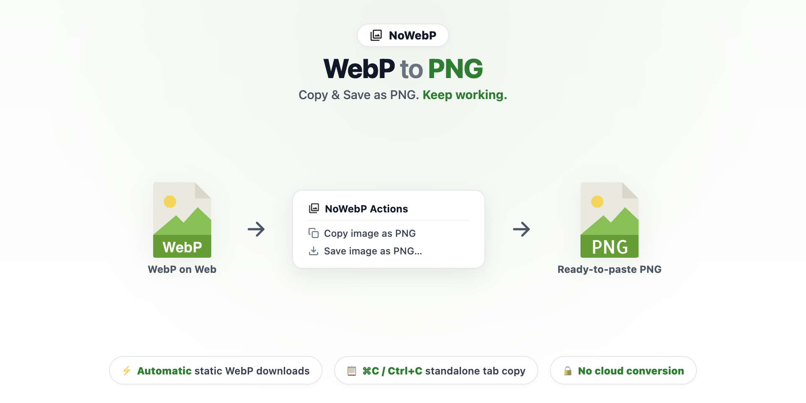

# NoWebP
**WebP to PNG, Copy & Save as PNG**

> No converter website. No format check. No unnecessary interruption. Just keep working.

  

  <a href="https://iknoest.github.io/NoWebP/test.html"><b>Test Lab</b></a> &nbsp;·&nbsp;
  <a href="https://iknoest.github.io/NoWebP/privacy.html"><b>Privacy Policy</b></a> &nbsp;·&nbsp;
  <a href="https://github.com/iknoest/NoWebP/issues"><b>Issues & Support</b></a>

---

## Why NoWebP?

I hate noticing WebP.

When I'm researching online, I often copy images directly into a PowerPoint slide. Normally that should take two seconds: find an image, copy it, paste it, keep working.

Then a WebP appears.

PowerPoint Web may respond with **“Can't paste the picture”**, breaking the flow. I have to save the image, convert it, find the converted file, insert it again, and then return to what I was actually trying to do.

Interestingly, the same image often works in Google Slides, which makes the interruption feel even more unnecessary.

NoWebP started from a simple goal:

**make WebP something I don't have to think about.**

It is not perfectly invisible yet. Chrome still owns some native image commands, and some edge cases intentionally fail safely rather than altering the image.

The goal stays simple:

**no converter website, no format check, no unnecessary interruption. Just keep working.**

---

## Test it yourself

Because NoWebP interacts directly with browser-native context menus, downloads, and the system clipboard, it cannot be tested within a static GitHub markdown page. Instead, a real, interactive test suite is published on GitHub Pages:

**[Open the NoWebP Test Lab](https://iknoest.github.io/NoWebP/test.html)**

### Quick 4-step walkthrough:
1. **Load NoWebP** in Chrome (`chrome://extensions` → enable *Developer mode* → *Load unpacked* → choose `extension/`).
2. **Open the [Test Lab](https://iknoest.github.io/NoWebP/test.html)** in your browser.
3. **Try the samples**: static WebP (lossy, lossless, alpha), real PNG, real JPEG, and animated WebP.
4. **Observe the result**: each test card describes the exact user action and the on-page expected outcome.

---

## Supported behavior summary

| Image Format / Input | Automatic Behavior | Explicit Context Menu ("Copy image as PNG" / "Save image as PNG…") |
| :--- | :--- | :--- |
| **Static WebP** | Auto-downloads as `.png`; standalone tab `⌘C` / `Ctrl+C` copies as PNG | Converted to PNG (clipboard / single-dialog save) |
| **Real PNG** | Untouched | Raw PNG bytes passed through verbatim (no re-encode) |
| **Real JPEG** | Untouched | Converted to PNG (clipboard / single-dialog save) |
| **Animated WebP** | Untouched (preserves animation) | Untouched; shows top notice: *"Animated WebP can't be copied or saved as a static PNG."* |
| **>80MP Large Images** | Fail safe (untouched to protect memory) | Fail safe (untouched; toast notice shown) |
| **Insecure (HTTP) Sources** | Fail open (left untouched to Chrome) | Fail open (unaltered) |

### Known limitations
- **Chrome native "Copy Image"**: Chrome's built-in right-click `Copy Image` is part of the native browser shell and cannot be intercepted by extensions. To copy as PNG, use NoWebP's own **"Copy image as PNG"** entry.
- **Keyboard copy scope**: Seamless keyboard copy (`⌘C` / `Ctrl+C` → PNG) is specifically supported when viewing a standalone static WebP in its own tab.
- **Animated WebP preservation**: Animated WebP is intentionally never flattened into a single static frame.
- **Memory safety guard**: Images exceeding 80 Megapixels fail safe without conversion to protect browser stability.

---

## Manual installation (unpacked extension)

1. Clone or download this repository.
2. Open `chrome://extensions` in Chrome.
3. Enable **Developer mode** (top-right toggle).
4. Click **Load unpacked**.
5. Select this repository's **`extension/`** folder (not the repository root).

NoWebP should now appear in your extensions list and is ready to use.

---

## Privacy

Image conversion runs locally in Chrome. NoWebP uses no cloud conversion, analytics, tracking, or developer-operated processing service.
- No analytics, tracking, or telemetry
- No cloud conversion or remote code execution
- No persistent storage of image history or clipboard data
- `clipboardRead` is never requested — NoWebP only writes PNG data upon your explicit or standalone copy action

Read the full [Privacy Policy](https://iknoest.github.io/NoWebP/privacy.html).

---

## Credits

Thanks to [tomkimberlin/Save-Image-As](https://github.com/tomkimberlin/Save-Image-As) for useful prior art around context-menu image conversion during NoWebP's early research.

NoWebP was built independently and does not include code from that project.

---

## Support

This repository's **[Issues](https://github.com/iknoest/NoWebP/issues)** page is the support and contact channel for NoWebP. Please open an issue for bugs, questions, or compatibility reports.

## License

No license has been assigned to this repository yet.
